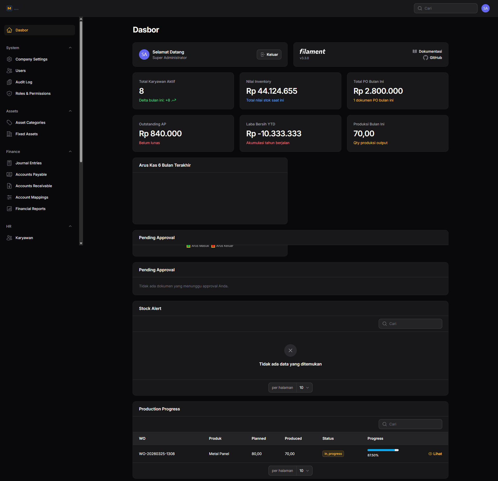
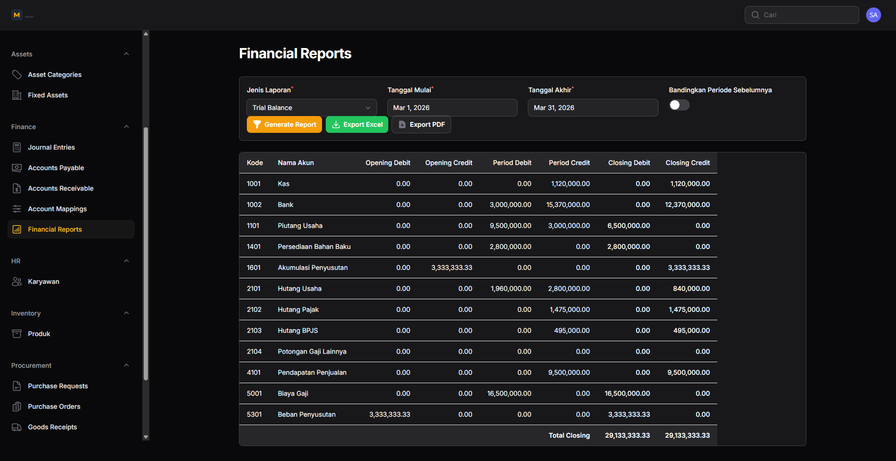

# Manufacture Admin

ERP manufaktur berbasis web untuk mengelola operasi lintas departemen dalam satu panel admin terintegrasi.

## Ringkasan Produk

Manufacture Admin dirancang untuk perusahaan manufaktur yang ingin menjalankan proses inti secara rapi dan terhubung:

- HR dan payroll
- inventory dan kontrol stok
- procurement dengan approval workflow
- finance dengan auto jurnal
- production berbasis BOM dan work order
- asset management, maintenance, dan depresiasi

## Mengapa Produk Ini

- Satu panel untuk banyak divisi
- Jejak audit aktivitas transaksi
- Integrasi antar modul operasional dan keuangan
- Siap dipakai untuk skala UKM sampai menengah

## Dokumen Promosi

- [Fitur yang Ditawarkan](FEATURES.md)
- [Screenshot Produk](SCREENSHOTS.md)
- [Tech Stack](TECH-STACK.md)
- [Paket Harga](PRICING.md)

## Preview Screenshot

Lihat daftar lengkap di [SCREENSHOTS.md](SCREENSHOTS.md).

## Tech Stack Singkat

- Laravel 11
- Filament 3
- PHP 8.2+
- Livewire
- MySQL/PostgreSQL
- Redis (opsional)

Detail lengkap di [TECH-STACK.md](TECH-STACK.md).

## Harga

Paket dan opsi implementasi tersedia di [PRICING.md](PRICING.md).

## Catatan

- Repository ini hanya berisi materi promosi dan dokumentasi publik.
- Source code aplikasi dikelola terpisah pada repository private.
