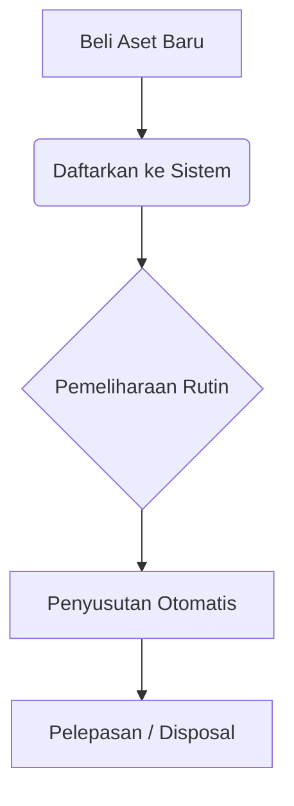

# Manajemen Aset (Fixed Assets)

Modul **Manajemen Aset** digunakan untuk melacak dan mengelola seluruh aset tetap (*fixed assets*) perusahaan, mulai dari pembelian, perhitungan depresiasi, hingga pelepasan (*disposal*).

## Gambaran Umum Alur Kerja

---

## 1. Kategori Aset

Mengelompokkan aset memudahkan pelaporan dan pengaturan metode depresiasi (penyusutan).

### Cara Membuat Kategori Aset:
1. Buka menu **Assets > Asset Categories**.
2. Klik tombol **New Asset Category**.
3. Isi informasi berikut:
   - **Code**: Kode unik kategori (contoh: `VEH` untuk Kendaraan).
   - **Name**: Nama kategori (contoh: *Kendaraan Operasional*).
   - **Depreciation Method**: Pilih antara *Straight Line* (Garis Lurus) atau *Declining Balance* (Saldo Menurun).
   - **Useful Life (Years)**: Estimasi umur ekonomis aset dalam tahun.
4. Klik **Create**.

---

## 2. Pendaftaran Aset Baru

Setiap aset fisik yang dibeli atau dimiliki harus dicatat ke dalam sistem.

### Langkah-langkah Mendaftarkan Aset:
1. Navigasi ke menu **Assets > Fixed Assets**.
2. Klik **New Fixed Asset**.
3. Lengkapi formulir pendaftaran:
   - **Kategori**: Pilih dari daftar yang sudah dibuat.
   - **Nama & Kode**: Beri nama jelas (contoh: *Mesin Genset 5000W*) dan kode inventaris.
   - **Harga Beli (Purchase Cost)**: Masukkan harga perolehan awal.
   - **Nilai Residu (Salvage Value)**: Estimasi nilai sisa aset di akhir umur ekonomis.
   - **Tanggal Akuisisi**: Tanggal aset mulai digunakan.
4. Klik **Create**.

> [!TIP]
> Tempelkan label *Barcode/QR Code* (dari kode inventaris) pada fisik aset agar mudah dilacak saat audit tahunan.

---

## 3. Perhitungan Penyusutan (Depresiasi)

Sistem akan otomatis menghitung beban penyusutan berdasarkan **Kategori Aset** yang Anda pilih. 

### Kapan Penyusutan Dihitung?
- Penyusutan berjalan secara otomatis di latar belakang pada akhir setiap bulan.
- Nilai Buku (*Book Value*) aset akan terus berkurang hingga mencapai Nilai Residu.
- Jurnal Keuangan untuk Beban Penyusutan akan **otomatis terbentuk** di modul *Finance*.

---

## 4. Pelepasan Aset (Disposal)

Jika aset dijual, rusak, atau dihibahkan, Anda harus mencatatnya sebagai *Disposed*.

1. Buka halaman detail **Fixed Asset** yang bersangkutan.
2. Ubah statusnya dari **Active** menjadi **Disposed**.
3. Masukkan **Tanggal Pelepasan**.
4. *(Opsional)* Jika aset dijual, buat jurnal manual di modul *Finance* untuk mencatat pemasukan kas dan selisih laba/rugi penjualan aset.
