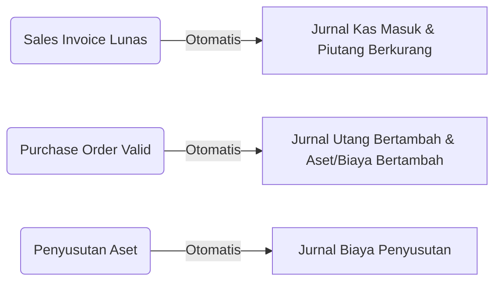

# Keuangan & Akuntansi (Finance)

Modul **Finance** adalah jantung dari ERP. Modul ini terintegrasi langsung dengan modul *Sales*, *Procurement*, dan *Asset*, sehingga Anda tidak perlu lagi membuat jurnal secara manual untuk transaksi sehari-hari!

## 1. Integrasi Jurnal Otomatis

Sistem secara cerdas membaca setiap transaksi yang terjadi di departemen lain dan membuat jurnal ganda (*Double-Entry Journal*) secara *real-time*.

---

## 2. Manajemen Utang & Piutang (AP / AR)

Pantau arus kas masa depan dengan mengawasi piutang pelanggan dan utang *supplier*.

### Accounts Payable (Utang)
1. Buka **Finance > Accounts Payable**.
2. Anda akan melihat daftar tagihan dari vendor (bersumber dari *Purchase Order*).
3. Untuk melakukan pembayaran, klik ikon **Edit** atau **View**.
4. Ubah status menjadi **Paid** dan pilih metode pembayaran (Kas/Bank). Jurnal pembayaran akan otomatis terbentuk.

### Accounts Receivable (Piutang)
1. Buka **Finance > Accounts Receivable**.
2. Daftar piutang dari pelanggan (bersumber dari *Sales Invoice*) akan tampil.
3. Saat pelanggan membayar, perbarui status invoice menjadi **Paid**. Uang akan tercatat masuk ke kas perusahaan.

---

## 3. Account Mappings (Pemetaan Akun)

Agar penjurnalan otomatis berjalan lancar, Anda harus memberitahu sistem akun mana yang digunakan untuk setiap tipe transaksi.

**Cara Memetakan Akun:**
1. Masuk ke **Finance > Account Mappings**.
2. Di sini Anda akan melihat kunci-kunci sistem (*mapping keys*) seperti `sales_revenue`, `inventory_asset`, `accounts_payable`, dll.
3. Pastikan setiap kunci dipetakan ke Kode Akun (Chart of Account) yang benar (contoh: `sales_revenue` dipetakan ke akun *Pendapatan Penjualan* - `400-10`).

> [!WARNING]
> Jangan mengubah *Account Mappings* di pertengahan bulan buku jika Anda tidak paham dampaknya terhadap Laporan Keuangan berjalan. Konsultasikan dengan Akuntan Kepala.

---

## 4. Laporan Keuangan (Financial Reports)

Sistem mampu menghasilkan laporan keuangan instan kapan pun Anda butuhkan.

Buka **Finance > Financial Reports**:
- **Buku Besar (General Ledger)**: Menampilkan rincian setiap pergerakan akun.
- **Neraca Saldo (Trial Balance)**: Ringkasan saldo debet-kredit seluruh akun.
- **Laba/Rugi (Income Statement)**: Melihat apakah perusahaan sedang untung atau rugi.
- **Neraca (Balance Sheet)**: Potret kekayaan perusahaan (Aset, Kewajiban, Modal).

> [!TIP]
> Gunakan tombol filter **Tanggal (Date Range)** untuk melihat laporan periode tertentu (misal: Q1 2026), lalu klik **Export to Excel** untuk analisa lebih lanjut!
