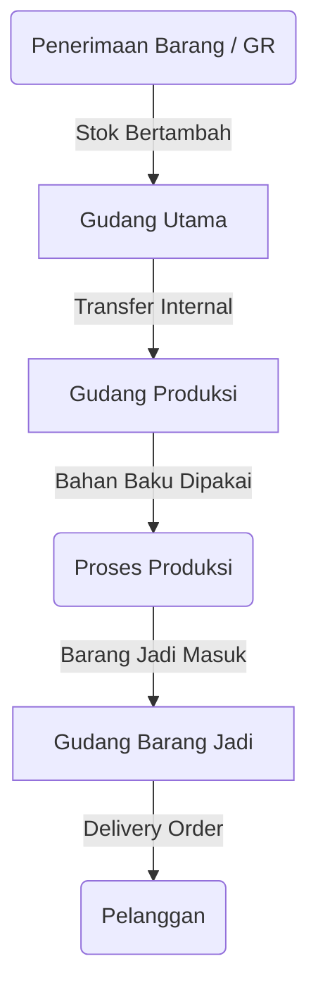

# Manajemen Inventori & WMS (Warehouse Management System)

Modul **Inventory & WMS** mengontrol seluruh pergerakan barang (material masuk, keluar, dan transfer antar gudang) serta memastikan keakuratan stok secara *real-time*.

## Gambaran Alur Pergerakan Stok

---

## 1. Master Produk (Products)

Semua barang, baik itu bahan baku (*raw material*), barang setengah jadi (*WIP*), maupun barang jadi (*finished goods*) harus didaftarkan di sini.

### Menambahkan Produk Baru
1. Buka **Inventory & WMS > Produk**.
2. Klik **New Produk**.
3. Lengkapi data:
   - **SKU**: Kode unik barang (dapat di-*generate* otomatis jika dikosongkan).
   - **Tipe Produk**: Pilih apakah barang ini aset, bahan baku, atau barang jadi.
   - **Batas Stok (Reorder Point)**: Stok minimum di mana sistem akan memberikan peringatan (warna merah di tabel).
4. Klik **Create**.

> [!TIP]
> **Cetak Barcode Label**: Anda dapat mencetak barcode langsung dari halaman tabel Produk. Centang produk, lalu klik tombol **Print Barcode** (ikon QR) untuk mencetak stiker fisik.

---

## 2. Penyesuaian Stok Manual (Stock Adjustment)

Terkadang jumlah stok fisik di gudang berbeda dengan di sistem (misal: karena hilang, rusak, atau salah hitung). Anda bisa melakukan penyesuaian manual.

1. Buka tabel **Produk**.
2. Di pojok kanan atas, klik tombol **Adjust Stock**.
3. Pilih produk, gudang, dan masukkan jumlah (*qty*).
4. Pilih tipe: **Penambahan** atau **Pengurangan**.
5. Wajib masukkan alasan (contoh: *Barang rusak karena bocor*).
6. Konfirmasi.

---

## 3. Transfer Antar Gudang (Inter-Warehouse Transfer)

Gunakan fitur ini untuk memindahkan stok dari Gudang A ke Gudang B.

1. Buka **Inventory & WMS > Inter Warehouse Transfer**.
2. Klik **New Transfer**.
3. Pilih **Gudang Asal (Source)** dan **Gudang Tujuan (Destination)**.
4. Tambahkan *Items* (produk apa saja yang mau dipindah beserta jumlahnya).
5. Simpan sebagai draft.
6. Saat barang benar-benar dikirim/diterima secara fisik, ubah statusnya menjadi **Completed**. Stok di gudang asal akan otomatis berkurang, dan gudang tujuan akan bertambah.

---

## 4. Pelacakan Buku Besar (Stock Ledger)

Untuk melihat kronologi kenapa stok sebuah barang bisa sejumlah X:
- Buka detail produk tersebut.
- Scroll ke bawah pada halaman *View*.
- Anda akan melihat tabel **Stock Ledger Relation** yang mencatat setiap in/out secara mendetail (siapa yang mengubah, lewat transaksi apa, tanggal berapa).
