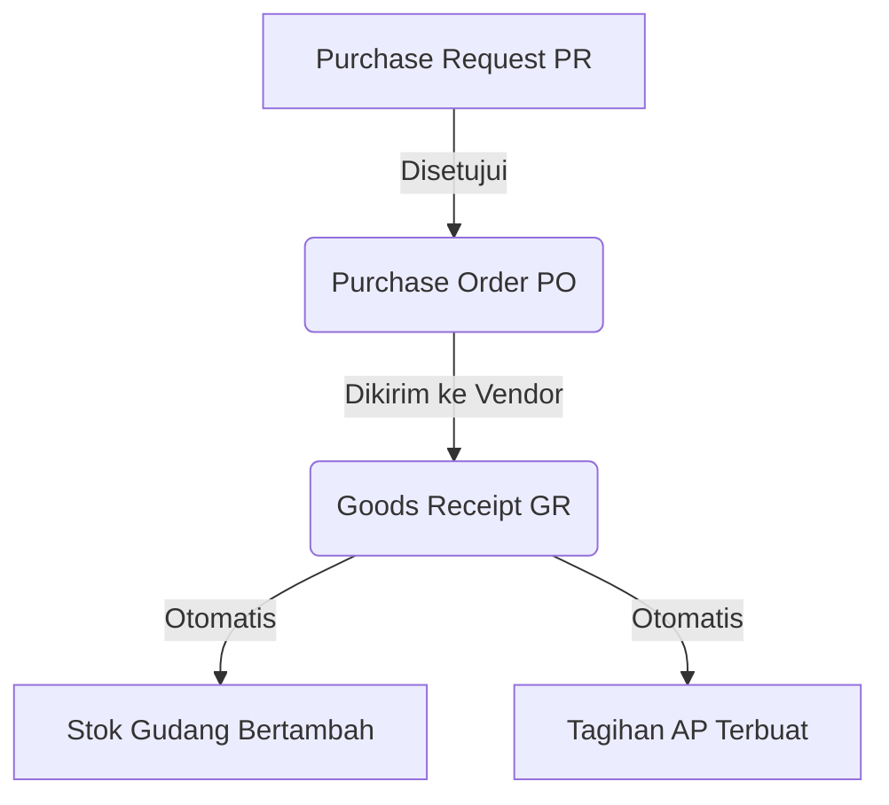

# Pengadaan (Procurement)

Modul **Procurement** mengelola pembelian bahan baku, aset, dan barang lainnya dari pihak luar (Vendor). Modul ini terikat ketat dengan sistem persetujuan berjenjang (*Approval Workflow*).

## Siklus Pengadaan Standar

---

## 1. Purchase Request (Permintaan Pembelian)

Semua pembelian harus diawali dengan pengajuan PR dari internal departemen.

1. Buka **Procurement > Purchase Requests**.
2. Klik **New Request**.
3. Isi tanggal, departemen pemohon, dan daftar barang (*items*) yang ingin dibeli beserta estimasi jumlah dan harganya.
4. Klik **Create**. Status awal adalah `Draft`.
5. Buka kembali PR tersebut, lalu klik tombol **Submit for Approval**.
6. Atasan (Manager) akan memverifikasi dan meng-klik **Approve** atau **Reject**.

---

## 2. Purchase Order (Pesanan Pembelian)

Setelah PR disetujui, Staf Purchasing (Pembelian) bisa mengubahnya menjadi *Purchase Order* (PO) resmi untuk dikirim ke *Vendor/Supplier*.

1. Buka **Procurement > Purchase Orders**.
2. Klik **New PO**, lalu pilih nomor PR yang sudah disetujui. Sistem akan **menyalin (pull)** semua barang dari PR tersebut secara otomatis!
3. Anda bisa menyesuaikan harga asli yang didapat dari negosiasi *Vendor*, beserta pajaknya.
4. Simpan. Jika nilai PO di atas limit (contoh: di atas Rp5.000.000), PO ini mungkin membutuhkan *Approval* lagi dari Direktur sesuai pengaturan di *System Settings*.

> [!IMPORTANT]
> Sistem dilengkapi fitur **Audit Trail**. Setiap harga atau jumlah barang yang Anda revisi pada dokumen PO akan terekam selamanya di tab *Log Aktivitas* bagian bawah dokumen!

---

## 3. Goods Receipt (Penerimaan Barang)

Saat *Vendor* mengantarkan barang fisik ke gudang Anda, bagian Gudang harus mencatat penerimaannya.

1. Buka **Procurement > Goods Receipts**.
2. Klik **New Goods Receipt**.
3. Masukkan referensi nomor **PO**.
4. Verifikasi bahwa kuantitas yang datang sesuai dengan yang dipesan di PO (Sistem memungkinkan *Partial Delivery* atau pengiriman bertahap).
5. Setelah GR disimpan dengan status **Received**, dua hal penting terjadi secara otomatis:
   - **Stok barang di gudang bertambah**.
   - **Tagihan Utang (Accounts Payable) terbentuk otomatis di modul Keuangan**.

Langkah selanjutnya adalah pihak Keuangan melakukan pembayaran di modul **Finance > Accounts Payable**.
