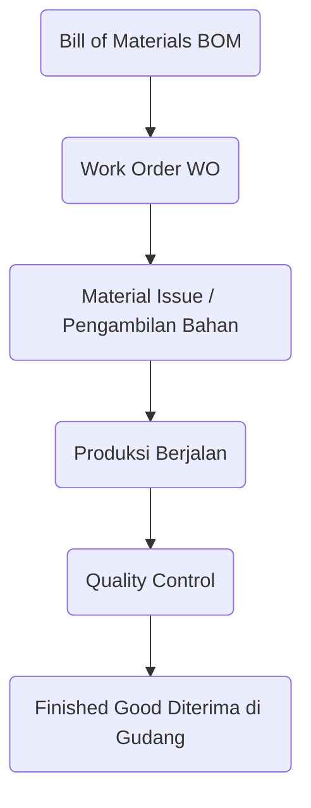

# Produksi (Manufacturing & MRP)

Modul **Production** adalah letak keunikan ERP Manufaktur ini. Di sini Anda mendefinisikan formula produk, mengeluarkan bahan baku, hingga menghasilkan barang jadi.

## Alur Produksi

---

## 1. Bill of Materials (BOM) / Resep Produksi

BOM adalah "resep masakan" untuk membuat suatu barang jadi (*Finished Good*). Anda harus mendefinisikan BOM sebelum bisa melakukan proses produksi.

1. Buka **Production & MRP > Bill Of Materials**.
2. Klik **New BOM**.
3. **Product**: Pilih barang jadi yang akan dibuat.
4. **Quantity**: Masukkan angka dasar resep (contoh: Untuk membuat *100 Kemeja*, butuh bahan apa saja?).
5. **Komponen (Components)**: Tambahkan daftar bahan baku (*Raw Material*) beserta jumlah kebutuhannya secara presisi.
6. Simpan.

---

## 2. Work Orders (Surat Perintah Kerja)

Saat pabrik siap memproduksi, Anda perlu menerbitkan *Work Order* (WO).

1. Buka **Production & MRP > Work Orders**.
2. Klik **New Work Order**.
3. Pilih *Product* yang ingin diproduksi.
4. Pilih resep **BOM**-nya.
5. Masukkan **Planned Quantity** (jumlah yang ingin diproduksi hari ini). Sistem akan secara ajaib **menghitung otomatis** total kebutuhan bahan baku di tabel komponen!
6. Tentukan tanggal mulai (*Start Date*) dan tanggal selesai (*End Date*).
7. Klik **Create**.

---

## 3. Eksekusi Produksi & Pemakaian Material

Setelah WO berstatus **In Progress**, Anda harus mengeluarkan bahan baku dari gudang (Proses ini disebut *Material Issue*).

1. Buka detail *Work Order* Anda.
2. Di bagian tabel material, verifikasi ketersediaan stok.
3. Ubah status produksi jika bahan baku sudah dipakai.
4. Saat fisik barang jadi selesai diproduksi, laporkan jumlah barang bagus (*Good Qty*) dan barang cacat (*Reject Qty*).

> [!WARNING]
> Memasukkan barang hasil produksi (Goods Output) akan **menambah** stok barang jadi di gudang, sekaligus memotong stok bahan baku berdasarkan persentase aktual. Jika proses ini memicu alarm stok habis pada bahan baku, modul *Inventory* akan memperingatkan staf *Procurement* untuk melakukan pembelian ulang (*Reorder*).
